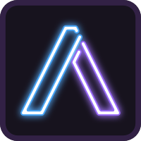
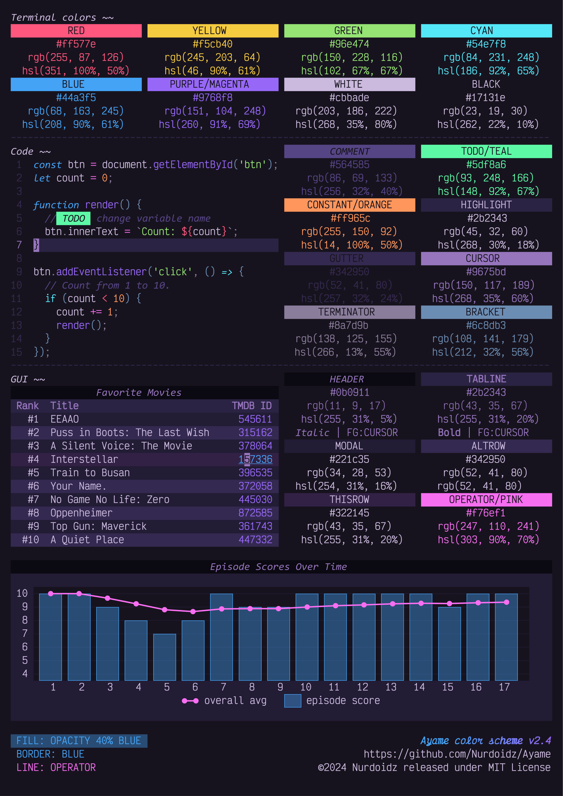
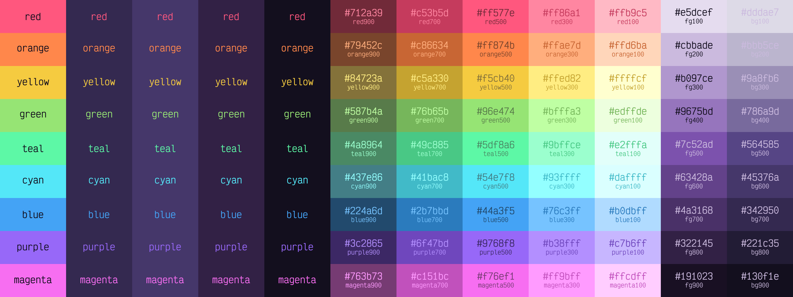

<div align="center">



# Ayame

</div>

A dark theme inspired by the nightly bright colors of cyber-neon anime. [Get it for your tool](#deployments).

## Contents

- [Ayame](#ayame)
  - [Contents](#contents)
  - [Color Palette](#color-palette)
  - [Deployments](#deployments)
  - [Building](#building)
    - [Tools Required](#tools-required)
    - [Procedure](#procedure)
  - [Templates](#templates)
    - [Example](#example)

## Color Palette




| Hex ____________ | ID | Uses |
| --- | --- | --- |
|  `#130f1e` | `background`, `bg`, `bg900` | Background |
|  `#cbbade` | `foreground`, `fg`, `fg200`, `variable`, `identifier` | Foreground, Variables, Identifiers |
|  `#ff577e` | `red`, `deleted`, `breakpoint`, `stop`, `this`, `bold`, `red500`, `h6` | Terminal Bright Red, Git deleted, Breakpoints, Stop, Language variables, Markdown bold, Header 6 |
|  `#ff965c` | `orange`, `warning`, `constant`, `orange500`, `h4` | Terminal Yellow, Warnings, Constants, Header 4 |
|  `#f5cb40` | `yellow`, `character`, `yellow500` | Terminal Bright Yellow, Characters, HTML attributes, CSS classes, Markdown alt text, Markdown link anchors |
|  `#96e474` | `green`, `added`, `debug`, `string`, `green500`, `h5`, `italic` | Terminal Bright Green, Git added, Debug, Strings, Header 5, Markdown italics |
|  `#5df8a6` | `teal`, `todo`, `teal500` | TODO comments |
|  `#54e7f8` | `cyan`, `match`, `control`, `regex`, `escape`, `cyan500`, `linkhover` | Terminal Bright Cyan, Find matches, Hyperlink hover, Control keywords, RegEx literals, Escape characters |
|  `#44a3f5` | `blue`, `primary`, `progress`, `modified`, `hyperlink`, `keyword`, `type`, `blue500`, `h1` | Terminal Bright Blue, Progress bars, Git modified, Hyperlinks, Keywords, Type, Header 1 |
|  `#9768f8` | `purple`, `darkmagenta`, `secondary`, `function`, `fun`, `attribute`, `code`, `purple500`, `h2` | Terminal Magenta, Debug token keys, Functions, Attributes, Markdown plain code blocks, Header 2 |
|  `#f76ef1` | `magenta`, `pink`, `tertiary`, `focus`, `operator`, `magenta500`, `pink500`, `value`, `h3` | Terminal Bright Magenta, Debug token values, Focus accents, Operator keywords, Header 3 |
|  `#662332` | `red900`, `error2` | Error background |
|  `#cc4665` | `red700`, `darkred`, `error`, `invalid`, `tag` | Terminal Red, Error, Invalid, Tags |
|  `#ff7998` | `red300` |  |
|  `#ffbccb` | `red100` |  |
|  `#663c25` | `orange900` |  |
|  `#cc784a` | `orange700` |  |
|  `#ffab7d` | `orange300` |  |
|  `#ffd5be` | `orange100` |  |
|  `#62511a` | `yellow900` |  |
|  `#c4a233` | `yellow700` |  |
|  `#f7d566` | `yellow300` |  |
|  `#fbeab3` | `yellow100` |  |
|  `#3c5b2e` | `green900` |  |
|  `#78b65d` | `green700`, `darkgreen`, `info` | Terminal Green, Info, String quotation marks |
|  `#abe990` | `green300` |  |
|  `#d5f4c7` | `green100` |  |
|  `#256342` | `teal900` |  |
|  `#4ac685` | `teal700` |  |
|  `#7df9b8` | `teal300` |  |
|  `#befcdb` | `teal100` |  |
|  `#225c63` | `cyan900` |  |
|  `#43b9c6` | `cyan700`, `darkcyan`, `class` | Terminal Cyan, Classes |
|  `#76ecf9` | `cyan300` |  |
|  `#bbf5fc` | `cyan100` |  |
|  `#1b4162` | `blue900` |  |
|  `#3682c4` | `blue700`, `darkblue`, `activitybadge`, `bookmark`, `blue2` | Terminal Blue, Bookmarks, VS Code activity badge |
|  `#69b5f7` | `blue300` |  |
|  `#b4dafb` | `blue100` |  |
|  `#3c2a63` | `purple900`, `activeitem` | Active item |
|  `#7953c6` | `purple700` |  |
|  `#ac86f9` | `purple300`, `activeitemtext` | Active item text |
|  `#d5c3fc` | `purple100` |  |
|  `#632c60` | `magenta900`, `pink900` |  |
|  `#c658c1` | `magenta700`, `pink700` |  |
|  `#f98bf4` | `magenta300`, `pink300` |  |
|  `#fcc5f9` | `magenta100`, `pink100` |  |
|  `#1a1528` | `bg850`, `tabline`, `blockquote`, `border2` | Markdown block quotes, Header Row, Secondary borders |
|  `#221c35` | `bg800`, `modal`, `menu`, `toolbar`, `checkbox`, `input` | Modal background, Checkbox background, Input background |
|  `#2b2343` | `bg750`, `subheader`, `altrow` | Subheader background, Alternate row background, Alternate modal background |
|  `#342950` | `bg700`, `black`, `hover`, `highlight`, `border`, `rule`, `button` | Terminal Black, Line highlight, UI hover highlight, Buttons, Borders, Rules and guides |
|  `#3c305d` | `bg650` |  |
|  `#45376a` | `bg600` |  |
|  `#4d3e78` | `bg550` |  |
|  `#564585` | `bg500`, `gray`, `gutter`, `folded`, `darkgray` | Terminal Bright Black, Line numbers, Folded code blocks |
|  `#675891` | `bg450`, `comment` | Comments |
|  `#786a9d` | `bg400` |  |
|  `#897daa` | `bg350` |  |
|  `#9a8fb6` | `bg300` |  |
|  `#aba2c2` | `bg250` |  |
|  `#bbb5ce` | `bg200` |  |
|  `#ccc7da` | `bg150` |  |
|  `#dddae7` | `bg100` |  |
|  `#191023` | `fg900` |  |
|  `#251934` | `fg850` |  |
|  `#322145` | `fg800`, `focusborder`, `highlightborder`, `modalhighlight`, `highlight2` | Highlight and focus border, Highlights in UI and modals |
|  `#3e2957` | `fg750` |  |
|  `#4a3168` | `fg700`, `selection` | Selection background |
|  `#573979` | `fg650` |  |
|  `#63428a` | `fg600` |  |
|  `#704a9c` | `fg550` |  |
|  `#7c52ad` | `fg500`, `underline` | Markdown underline |
|  `#8963b5` | `fg450` |  |
|  `#9675bd` | `fg400`, `cursor`, `activeborder`, `active` | Cursor, Active border, Active line number, Subheader foreground, Badge background, Minimap and scrollbar background, Markdown table text |
|  `#a386c6` | `fg350` |  |
|  `#b097ce` | `fg300`, `blockquotetext` | Blockquote text |
|  `#bea9d6` | `fg250` |  |
|  `#d8cbe6` | `fg150` |  |
|  `#e5dcef` | `fg100`, `white`, `object` | Terminal Bright White, Objects |
|  `#6c8db3` | `bracket` | Parentheses, Brackets, Braces |
|  `#8a7d9b` | `lightgray`, `darkwhite`, `muted`, `punctuation`, `terminator` | Terminal White, Muted text, Punctuation |
|  `#bbbbbb` | `foreground2` | Alternate foreground |
|  `#ffffff` | `purewhite` | Extra white for lighter backgrounds, Badge foreground |
|  `#0b0911` | `header` | Modal header background |

## Deployments

Ayame is available for the following tools:

- [Microsoft Office](bin/office/README.md)
- [Stylus (Websites)](bin/usercss/README.md)
- [Visual Studio Code](https://github.com/AyameTheme/vscode)
- [Windows Terminal](bin/windowsterminal/README.md)

## Building

Color definitions are contained in `src/ayame-colors.json`. This file is the main 'editable' file used for modifying the color palette. This file is used to generate `bin/ayame.json`, which is the main file used to place colors in template files. For example, this is the output definition for "background":

```json
"background": {
  "hex": "#17131e",
  "r": 23,
  "red": 23,
  "red_percent": 0.09019607843137255,
  "g": 19,
  "green": 19,
  "green_percent": 0.07450980392156863,
  "b": 30,
  "blue": 30,
  "blue_percent": 0.11764705882352941,
  "rgb": "rgb(23, 19, 30)",
  "h": 261.8181818181818,
  "hue": 261.8181818181818,
  "s": 0.22448979591836737,
  "saturation": 0.22448979591836737,
  "l": 0.09607843137254901,
  "lightness": 0.09607843137254901,
  "hsl": "hsl(262, 22%, 10%)"
}
```

`ayame.json` is verbose and robust. There are complete color definitions for every ID in the color palette table, even if the same color has more than one ID. For example, `background` and `bg` have identical yet separate definitions in `ayame.json`, so referencing `ayame.json:colors.background.hex` is identical to `ayame.json:colors.bg.hex` since their IDs are associated with the same color in `ayame-colors.json`.

There are multiple benefits to this model. Firstly, templates referencing colors can use contextual IDs so the template reads less confusing and IDs themselves can be changed to different colors easily. For example:

1. One template contains `#ff577e`, which will be replaced with `#ff6394` by the build script. The developer used this variable to style some bold text.
2. The developer decides to be more specific and uses `#ff577e` instead.
3. The developer wishes to change the bold color, so he changes the hex code in `ayame-colors.json` for ID `bold` to `#76b5c5`. Not only will this change affect all instances when the ID `bold` is referenced, but IDs (`red`, `deleted`, `this`, etc.) previously grouped with ID `bold` are not affected, and will remain red.

### Tools Required

The build script uses the following tools:

- [PowerShell v7+](https://github.com/PowerShell/PowerShell) (cross-platform), available as the shell used in your terminal, or as `pwsh` in PATH. Check version with `pwsh --version`.
- [Inkscape v1+](https://github.com/inkscape/inkscape), available in as `inkscape` in PATH. Used to generate the palette graphic. Check version with `inkscape --version`.
- [Victor Mono](https://github.com/rubjo/victor-mono). Used in the palette graphic.

### Procedure

To build the project:

1. Clone (or download zip and extract) this repository.
2. Open a terminal in the cloned directory. Execute the following command:

    ```powershell
    # In PowerShell
    & .\build.ps1
    ```

    Or in a non-PowerShell terminal:

    ```bash
    pwsh -NoProfile -ExecutionPolicy Bypass -File ./build.ps1
    ```

## Templates

You can create templates and the build script will replace 'variables' with values from `ayame.json`. The build script will navigate through the JSON tree and replace the key with the appropriate value. Here is the format:

```
@ayame:key.sub_key.sub_sub_key@
```

A template file recognized by the build script contains `.ayame-template` anywhere in the file name in the `src` directory. It will place the product in `out`, removing `.ayame-template` from the file name, and following a subdirectory structure if relevant.

```
src/subdir/myfile.ayame-template.md
-> out/subdir/myfile.md

src/graphic.ayame-template.svg
-> out/graphic.svg
```

### Example

The build script finds a file named `custom.ayame-template.md` in the `src` directory. In this file:

```markdown
How much red is in orange? This much: @ayame:colors.orange.r@
```

It finds the following string and recognizes it as a variable to be replaced:

```
@ayame:colors.orange.r@
```

...will be replaced with:

```
231
```

...since `colors.orange.r` is a valid key to a value in `mock.json`:

```json
{
  "colors": {
    "orange": {
      "r": 231,
      // ...
    },
    // ...
  },
  // ...
}
```

...resulting in `custom.md` in the `out` directory with the following contents:

```markdown
How much red is in orange? This much: 231
```
