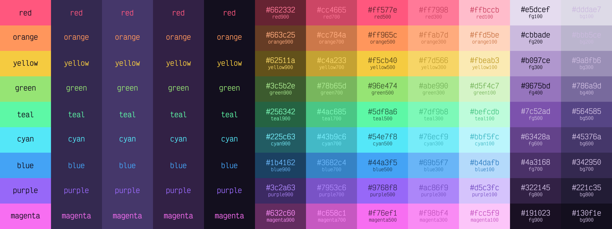

<div align="center">


# Ayame

</div>

A dark theme inspired by the nightly bright colors of cyber-neon anime. [Get it for your tool](#deployments).

## Contents

- [Ayame](#ayame)
  - [Contents](#contents)
  - [Color Palette](#color-palette)
  - [Deployments](#deployments)
  - [Building](#building)
    - [Tools Required](#tools-required)
    - [Procedure](#procedure)
  - [Templates](#templates)
    - [Example](#example)

## Color Palette



| Hex ____________ | ID | Uses |
| --- | --- | --- |
|  `#130f1e`<br>`rgb(19 15 30)` | `background`, `bg`, `bg900` | Background |
|  `#cbbade`<br>`rgb(203 186 222)` | `foreground`, `fg`, `fg200`, `variable`, `identifier` | Foreground, Variables, Identifiers |
|  `#ff4b73`<br>`rgb(255 75 115)` | `red`, `deleted`, `breakpoint`, `stop`, `this`, `red500`, `h6` | Terminal Bright Red, Git deleted, Breakpoints, Stop, Language variables, Header 6 |
|  `#ff874b`<br>`rgb(255 135 75)` | `orange`, `warning`, `constant`, `orange500`, `h4`, `conflict` | Terminal Yellow, Warnings, Constants, Header 4, Predefined symbols, Git conflict |
|  `#f5cb40`<br>`rgb(245 203 64)` | `yellow`, `character`, `yellow500` | Terminal Bright Yellow, Characters, HTML attributes, CSS classes, Markdown alt text, Markdown link anchors |
|  `#96e474`<br>`rgb(150 228 116)` | `green`, `added`, `debug`, `string`, `green500`, `h5`, `italic` | Terminal Bright Green, Git added, Debug, Strings, Header 5, Markdown italics, Property values |
|  `#5df8a6`<br>`rgb(93 248 166)` | `teal`, `todo`, `teal500`, `inlinecode` | TODO comments, Inline code |
|  `#54e7f8`<br>`rgb(84 231 248)` | `cyan`, `match`, `control`, `regex`, `escape`, `cyan500`, `linkhover` | Terminal Bright Cyan, Find matches, Hyperlink hover, Control keywords, RegEx literals, Escape characters |
|  `#44a3f5`<br>`rgb(68 163 245)` | `blue`, `primary`, `progress`, `modified`, `hyperlink`, `keyword`, `type`, `blue500`, `h1` | Terminal Bright Blue, Progress bars, Git modified, Hyperlinks, Keywords, Type, Header 1 |
|  `#9768f8`<br>`rgb(151 104 248)` | `purple`, `darkmagenta`, `secondary`, `function`, `fun`, `attribute`, `code`, `purple500`, `h2`, `key` | Terminal Magenta, Debug token keys, Property keys, Functions, Attributes, Markdown plain code blocks, Header 2 |
|  `#f76ef1`<br>`rgb(247 110 241)` | `magenta`, `pink`, `tertiary`, `focus`, `operator`, `magenta500`, `pink500`, `bold`, `value`, `h3` | Terminal Bright Magenta, Debug token values, Focus accents, Operator keywords, Markdown bold, Header 3 |
|  `#6f2332`<br>`rgb(111 35 50)` | `red900`, `error2` | Error background, Git deleted background |
|  `#c43053`<br>`rgb(196 48 83)` | `red700`, `darkred`, `error`, `invalid`, `tag` | Terminal Red, Error, Invalid, Tags |
|  `#ff7e97`<br>`rgb(255 126 151)` | `red300` |  |
|  `#ffb3bd`<br>`rgb(255 179 189)` | `red100` |  |
|  `#79452c`<br>`rgb(121 69 44)` | `orange900` | Git conflict background |
|  `#c86634`<br>`rgb(200 102 52)` | `orange700` |  |
|  `#ffae7d`<br>`rgb(255 174 125)` | `orange300`, `parameter` | Parameters |
|  `#ffd6ba`<br>`rgb(255 214 186)` | `orange100` |  |
|  `#84723a`<br>`rgb(132 114 58)` | `yellow900` |  |
|  `#c5a330`<br>`rgb(197 163 48)` | `yellow700`, `verbose` | Verbose |
|  `#ffed82`<br>`rgb(255 237 130)` | `yellow300` |  |
|  `#ffffcf`<br>`rgb(255 255 207)` | `yellow100` |  |
|  `#587b4a`<br>`rgb(88 123 74)` | `green900` | Git added background |
|  `#76b65b`<br>`rgb(118 182 91)` | `green700`, `darkgreen`, `info` | Terminal Green, Info, String quotation marks |
|  `#bfffa3`<br>`rgb(191 255 163)` | `green300` |  |
|  `#edffde`<br>`rgb(237 255 222)` | `green100` |  |
|  `#4a8964`<br>`rgb(74 137 100)` | `teal900` |  |
|  `#49c885`<br>`rgb(73 200 133)` | `teal700` |  |
|  `#9bffce`<br>`rgb(155 255 206)` | `teal300`, `instance` | Instance fields |
|  `#e2fffa`<br>`rgb(226 255 250)` | `teal100` |  |
|  `#437e86`<br>`rgb(67 126 134)` | `cyan900` |  |
|  `#41bac8`<br>`rgb(65 186 200)` | `cyan700`, `darkcyan`, `class` | Terminal Cyan, Classes |
|  `#93ffff`<br>`rgb(147 255 255)` | `cyan300`, `static` | Static fields |
|  `#daffff`<br>`rgb(218 255 255)` | `cyan100` |  |
|  `#224a6d`<br>`rgb(34 74 109)` | `blue900` | Git modified background |
|  `#2b7bbd`<br>`rgb(43 123 189)` | `blue700`, `darkblue`, `activitybadge`, `bookmark`, `blue2` | Terminal Blue, Bookmarks, VS Code activity badge |
|  `#76c3ff`<br>`rgb(118 195 255)` | `blue300` |  |
|  `#b0dbff`<br>`rgb(176 219 255)` | `blue100` |  |
|  `#3c2865`<br>`rgb(60 40 101)` | `purple900`, `activeitem` | Active item |
|  `#6f47bd`<br>`rgb(111 71 189)` | `purple700` |  |
|  `#b38fff`<br>`rgb(179 143 255)` | `purple300`, `activeitemtext` | Active item text, Named argument |
|  `#c7b6ff`<br>`rgb(199 182 255)` | `purple100` |  |
|  `#763b73`<br>`rgb(118 59 115)` | `magenta900`, `pink900` |  |
|  `#c151bc`<br>`rgb(193 81 188)` | `magenta700`, `pink700` |  |
|  `#ff9bff`<br>`rgb(255 155 255)` | `magenta300`, `pink300`, `annotation`, `metadata` | Annotations, Metadata |
|  `#ffcdff`<br>`rgb(255 205 255)` | `magenta100`, `pink100`, `reassigned` | Reassigned local variable |
|  `#1a1528`<br>`rgb(26 21 40)` | `bg850`, `tabline`, `blockquote`, `border2` | Markdown block quotes, Header Row, Secondary borders |
|  `#221c35`<br>`rgb(34 28 53)` | `bg800`, `modal`, `menu`, `toolbar`, `checkbox`, `input` | Modal background, Checkbox background, Input background |
|  `#2b2343`<br>`rgb(43 35 67)` | `bg750`, `subheader`, `altrow` | Subheader background, Alternate row background, Alternate modal background |
|  `#342950`<br>`rgb(52 41 80)` | `bg700`, `black`, `hover`, `highlight`, `border`, `rule`, `button` | Terminal Black, Line highlight, UI hover highlight, Buttons, Borders, Rules and guides |
|  `#3c305d`<br>`rgb(60 48 93)` | `bg650` |  |
|  `#45376a`<br>`rgb(69 55 106)` | `bg600` |  |
|  `#4d3e78`<br>`rgb(77 62 120)` | `bg550` |  |
|  `#564585`<br>`rgb(86 69 133)` | `bg500`, `gray`, `gutter`, `folded`, `darkgray` | Terminal Bright Black, Line numbers, Folded code blocks |
|  `#675891`<br>`rgb(103 88 145)` | `bg450`, `comment` | Comments |
|  `#786a9d`<br>`rgb(120 106 157)` | `bg400` |  |
|  `#897daa`<br>`rgb(137 125 170)` | `bg350` |  |
|  `#9a8fb6`<br>`rgb(154 143 182)` | `bg300` |  |
|  `#aba2c2`<br>`rgb(171 162 194)` | `bg250` |  |
|  `#bbb5ce`<br>`rgb(187 181 206)` | `bg200` |  |
|  `#ccc7da`<br>`rgb(204 199 218)` | `bg150` |  |
|  `#dddae7`<br>`rgb(221 218 231)` | `bg100` |  |
|  `#191023`<br>`rgb(25 16 35)` | `fg900` |  |
|  `#251934`<br>`rgb(37 25 52)` | `fg850` |  |
|  `#322145`<br>`rgb(50 33 69)` | `fg800`, `focusborder`, `highlightborder`, `modalhighlight`, `highlight2` | Highlight and focus border, Highlights in UI and modals |
|  `#3e2957`<br>`rgb(62 41 87)` | `fg750` |  |
|  `#4a3168`<br>`rgb(74 49 104)` | `fg700`, `selection` | Selection background |
|  `#573979`<br>`rgb(87 57 121)` | `fg650` |  |
|  `#63428a`<br>`rgb(99 66 138)` | `fg600` |  |
|  `#704a9c`<br>`rgb(112 74 156)` | `fg550` |  |
|  `#7c52ad`<br>`rgb(124 82 173)` | `fg500`, `underline` | Markdown underline |
|  `#8963b5`<br>`rgb(137 99 181)` | `fg450` |  |
|  `#9675bd`<br>`rgb(150 117 189)` | `fg400`, `cursor`, `activeborder`, `active` | Cursor, Active border, Active line number, Subheader foreground, Badge background, Minimap and scrollbar background, Markdown table text |
|  `#a386c6`<br>`rgb(163 134 198)` | `fg350` |  |
|  `#b097ce`<br>`rgb(176 151 206)` | `fg300`, `blockquotetext` | Blockquote text |
|  `#bea9d6`<br>`rgb(190 169 214)` | `fg250` |  |
|  `#d8cbe6`<br>`rgb(216 203 230)` | `fg150` |  |
|  `#e5dcef`<br>`rgb(229 220 239)` | `fg100`, `white`, `object` | Terminal Bright White, Objects |
|  `#6c8db3`<br>`rgb(108 141 179)` | `bracket` | Parentheses, Brackets, Braces |
|  `#8a7d9b`<br>`rgb(138 125 155)` | `lightgray`, `darkwhite`, `muted`, `unused`, `punctuation`, `terminator` | Terminal White, Muted text, Punctuation, Unused code |
|  `#bbbbbb`<br>`rgb(187 187 187)` | `foreground2` | Alternate foreground |
|  `#ffffff`<br>`rgb(255 255 255)` | `purewhite` | Extra white for lighter backgrounds, Badge foreground |
|  `#0b0911`<br>`rgb(11 9 17)` | `header` | Modal header background |

## Deployments

Ayame is available for the following tools:

- [Microsoft Office](bin/office/README.md)
- [Stylus (Websites)](bin/usercss/README.md)
- [Visual Studio Code](https://github.com/AyameTheme/vscode)
- [Windows Terminal](bin/windowsterminal/README.md)

## Building

Color definitions are contained in `src/ayame-colors.json`. This file is the main 'editable' file used for modifying the color palette. This file is used to generate `bin/ayame.json`, which is the main file used to place colors in template files. For example, this is the output definition for "background":

```json
"background": {
  "hex": "#17131e",
  "r": 23,
  "red": 23,
  "red_percent": 0.09019607843137255,
  "g": 19,
  "green": 19,
  "green_percent": 0.07450980392156863,
  "b": 30,
  "blue": 30,
  "blue_percent": 0.11764705882352941,
  "rgb": "rgb(23, 19, 30)",
  "h": 261.8181818181818,
  "hue": 261.8181818181818,
  "s": 0.22448979591836737,
  "saturation": 0.22448979591836737,
  "l": 0.09607843137254901,
  "lightness": 0.09607843137254901,
  "hsl": "hsl(262, 22%, 10%)"
}
```

`ayame.json` is verbose and robust. There are complete color definitions for every ID in the color palette table, even if the same color has more than one ID. For example, `background` and `bg` have identical yet separate definitions in `ayame.json`, so referencing `ayame.json:colors.background.hex` is identical to `ayame.json:colors.bg.hex` since their IDs are associated with the same color in `ayame-colors.json`.

There are multiple benefits to this model. Firstly, templates referencing colors can use contextual IDs so the template reads less confusing and IDs themselves can be changed to different colors easily. For example:

1. One template contains `#ff4b73`, which will be replaced with `#ff6394` by the build script. The developer used this variable to style some bold text.
2. The developer decides to be more specific and uses `#f76ef1` instead.
3. The developer wishes to change the bold color, so he changes the hex code in `ayame-colors.json` for ID `bold` to `#76b5c5`. Not only will this change affect all instances when the ID `bold` is referenced, but IDs (`red`, `deleted`, `this`, etc.) previously grouped with ID `bold` are not affected, and will remain red.

### Tools Required

The build script uses the following tools:

- [PowerShell v7+](https://github.com/PowerShell/PowerShell) (cross-platform), available as the shell used in your terminal, or as `pwsh` in PATH. Check version with `pwsh --version`.
- [Inkscape v1+](https://github.com/inkscape/inkscape), available in as `inkscape` in PATH. Used to generate the palette graphic. Check version with `inkscape --version`.
- [Victor Mono](https://github.com/rubjo/victor-mono). Used in the palette graphic.

### Procedure

To build the project:

1. Clone (or download zip and extract) this repository.
2. Open a terminal in the cloned directory. Execute the following command:

    ```powershell
    # In PowerShell
    & .\build.ps1
    ```

    Or in a non-PowerShell terminal:

    ```bash
    pwsh -NoProfile -ExecutionPolicy Bypass -File ./build.ps1
    ```

## Templates

You can create templates and the build script will replace 'variables' with values from `ayame.json`. The build script will navigate through the JSON tree and replace the key with the appropriate value. Here is the format:

```
@ayame:key.sub_key.sub_sub_key@
```

A template file recognized by the build script contains `.ayame-template` anywhere in the file name in the `src` directory. It will place the product in `out`, removing `.ayame-template` from the file name, and following a subdirectory structure if relevant.

```
src/subdir/myfile.ayame-template.md
-> out/subdir/myfile.md

src/graphic.ayame-template.svg
-> out/graphic.svg
```

### Example

The build script finds a file named `custom.ayame-template.md` in the `src` directory. In this file:

```markdown
How much red is in orange? This much: @ayame:colors.orange.r@
```

It finds the following string and recognizes it as a variable to be replaced:

```
@ayame:colors.orange.r@
```

...will be replaced with:

```
231
```

...since `colors.orange.r` is a valid key to a value in `mock.json`:

```json
{
  "colors": {
    "orange": {
      "r": 231,
      // ...
    },
    // ...
  },
  // ...
}
```

...resulting in `custom.md` in the `out` directory with the following contents:

```markdown
How much red is in orange? This much: 231
```
